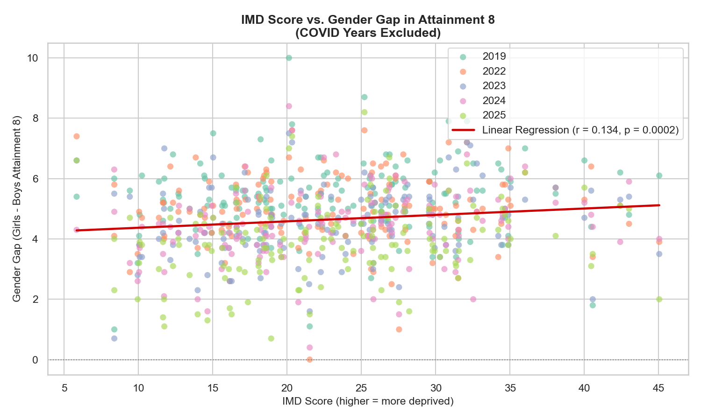
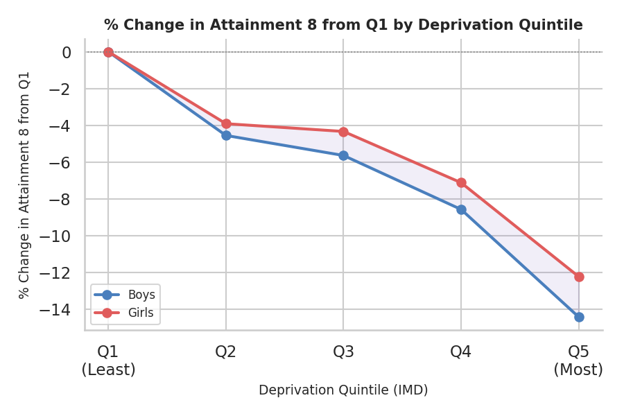
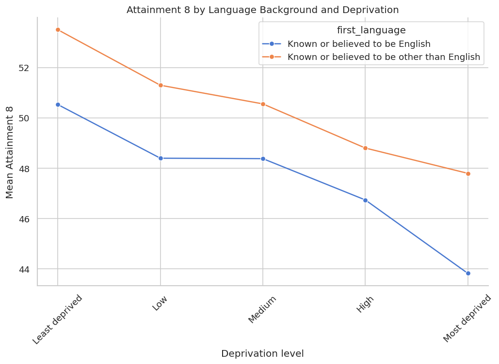
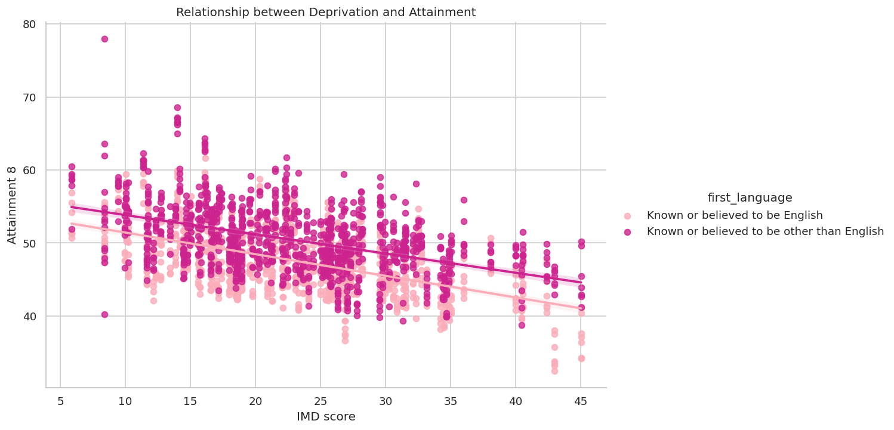
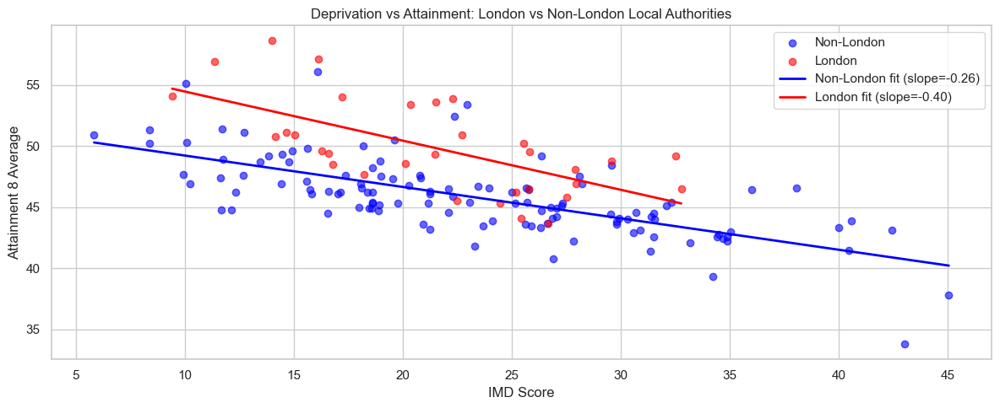
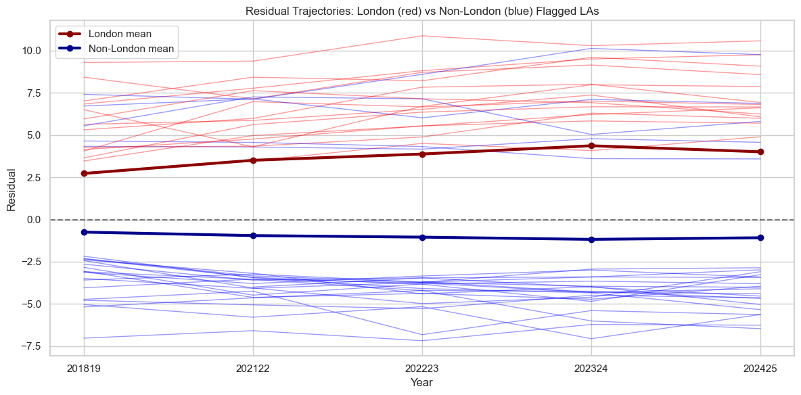

# Deprivation and School Performance in England (2019–2025)
## Written Report — CFG Data Science Group Project

**Group 6 Members:** Aisling, Kara, Olesya, Olivia, Raquel, and Sotiria  
**Repository:** https://github.com/AislingLangston/CFG-DS-group-6-2026  
**Date:** June 2026  

---

## 1. Introduction & Background
This project analyzes the relationship between regional deprivation—using the **2019 Indices of Multiple Deprivation (IMD)**—and **Key Stage 4 (KS4) school performance** in England.

We address the following research questions:
1. How does overall school performance vary between the most and least deprived Local Authorities, and has this attainment gap widened or narrowed between 2019 and 2025?
2. Which specific sub-domain of deprivation has the strongest negative correlation with a region's educational outcomes?
3. Are there certain core EBacc subjects (e.g., Maths, Science, Humanities, Languages) that are more resilient to the effects of deprivation compared to others?
4. How does the performance gap between boys and girls change across different deprivation levels?
5. How does the performance of pupils with English as an Additional Language (EAL) compare to first-language English speakers across different deprivation levels?
6. Which Local Authorities consistently outperform or underperform their predicted Attainment 8 score, and is there a geographic pattern among these outliers?

*Target Audience:* DfE policymakers (for Pupil Premium allocation), educational charities/NGOs, and school leaders.

---

## 2. Methodology & Implementation

### Data Sourcing & Preprocessing
* **Sources:** DfE KS4 Data (2018/19–2024/25), IMD 2019 (LSOA level), and ONS boundary lookups.
* **Aggregation:** LSOA-level IMD scores were aggregated to Upper-tier Local Authority (UTLA) level using population-weighted averages.
* **Data Cleansing:** Reconciled boundary shifts (e.g., Cumbria, Northamptonshire), converted DfE suppression flags ('c', 'z') to `NaN`, and excluded COVID-affected years (2019/20 and 2020/21) due to teacher-assessment grade inflation.

Per-year linear regressions of Attainment 8 against IMD score were used to calculate residuals for each Local Authority, with LAs whose mean residual across all examined years fell more than one standard deviation from the mean classified as consistent Outperformers or Underperformers. Geographic and sub-domain analyses were then conducted to investigate whether performance group membership was associated with London borough status or any specific deprivation dimension. 

### Implementation & Tools
* **Team Roles:** 
After the initial data cleaning, each member of the team took the lead on a separate RQ.
Question 1: Soteria
Question 2: Olivia
Question 3: Olesya
Question 4: Raquel
Question 5: Kara
Question 6: Aisling 

* **Stack:** Python (Pandas, NumPy, SciPy) and Matplotlib/Seaborn.

---

## 3. Results

### Q1: Performance by Deprivation Level Over Time

**Research Question:**  
How does overall school performance vary between the most and least deprived Local Authorities, and has this attainment gap widened or narrowed between 2019 and 2025?

**Methodology:**  
Local Authorities were ranked using the 2019 Index of Multiple Deprivation (IMD) scores. The 10 most deprived and 10 least deprived Local Authorities were selected. Average Attainment 8 scores were calculated annually between 2019 and 2025 for each group. The difference between the two groups was used to measure the attainment gap over time.

**Results:**  
Educational attainment was consistently higher in the least deprived Local Authorities than in the most deprived Local Authorities throughout the study period.

The least deprived areas achieved average Attainment 8 scores ranging from 51.08 to 55.57, while the most deprived areas achieved scores ranging from 40.92 to 46.28.

The attainment gap increased from 8.88 points in 2019 to a peak of 10.28 points in 2022 before narrowing slightly to 9.50 points in 2025.

Although both groups experienced fluctuations over time, the performance gap remained substantial across all years, suggesting a persistent relationship between deprivation and educational outcomes.

**Key Findings:**
* Least deprived areas consistently outperformed most deprived areas.
* The attainment gap widened between 2019 and 2022.
* The gap narrowed slightly after 2022 but remained larger than in 2019.
* Deprivation remains strongly associated with lower educational attainment.

    <em>Figure 1.1: Average Attainment 8 scores for the 10 most deprived and 10 least deprived Local Authorities between 2019 and 2025.</em>

### Q2

### Q3: Subject-Specific Resilience to Deprivation

For Q3, we examined whether some EBacc subjects are less affected by deprivation than others. Subject-specific APS scores were analysed for English, Maths, Science, Humanities and Languages. Two deprivation measures were used: average IMD score and the percentage of highly deprived neighbourhoods within each Local Authority.

Table 3.1: Correlation between deprivation and subject attainment

Subject	| Corr(IMD)	| Corr(% Highly Deprived)
--------|-----------|--------------------------
English	| -0.520325	| -0.525137
Maths	| -0.614029	| -0.613521
Science |	-0.600584	| -0.599225
Humanities |	-0.59566 |	-0.586752
Languages	| -0.310951	| -0.35924

All subjects show a negative relationship between deprivation and attainment. Maths, Science and Humanities display the strongest correlations with deprivation, while Languages show the weakest relationship. Similar patterns are observed using both deprivation measures, suggesting that the findings are robust.

Local Authorities were also grouped into deprivation deciles to compare attainment across the deprivation spectrum and calculate attainment gaps between the least and most deprived authorities.

Table 3.2: Average APS scores across deprivation deciles
Deciles | English	| Maths |	Science	| Humanities|	Languages
--|-------|----------|--------|-----------|---------
Least deprived	| 5.33	| 5.05	| 5	| 4.34	| 2.62
Most deprived	| 4.6	| 4.15 |	4.09	| 3.29	| 1.87
Gap	| 0.73 |	0.9	| 0.91 |	1.05 |	0.75

Average attainment declines steadily as deprivation increases across all subjects. The largest attainment gap is observed in Humanities (1.05 APS points), followed by Science (0.91) and Maths (0.89). English (0.73) and Languages (0.75) show the smallest gaps, suggesting that these subjects are relatively more resilient to deprivation.

Finally, subject participation rates were analysed to investigate whether deprivation influences subject entry patterns.

Table 3.3: Subject participation rates across deprivation deciles
Deciles	|Eng entering %|	Math entering %	|Sci entering %	|Hum entering %	|Lang entering %
----|----|----|-----|----|-----
Least deprived	|95.55	|97.28	|95.55	|82.96	|48.61
Most deprived	|93.51|	95.85|	93.48|	77.85|	38.65
Gap	|2.04	|1.43|	2.07|	5.11|	9.96

Entry rates for English, Maths and Science remain consistently high across deprivation groups. Humanities participation declines moderately, while Languages show the largest reduction in participation, falling from 48.6% in the least deprived authorities to 38.7% in the most deprived authorities. This indicates that pupils in more deprived areas are substantially less likely to study a language qualification.

**Conclusion**

Deprivation is associated with lower attainment across all EBacc subjects. However, the strength of this relationship varies between subjects. English and Languages appear to be the most resilient subjects, showing the smallest attainment gaps across deprivation levels, while Humanities show the strongest association with deprivation.

An interesting pattern emerges for Languages. Although language attainment appears relatively resilient to deprivation, participation decreases substantially in more deprived authorities. This suggests that the pupils taking language qualifications in more deprived areas may represent a more selective group, although further investigation would be required to confirm this explanation.

### Q4: The Gender Gap and Deprivation
* **Correlation & ANOVA:** Deprivation weakly but significantly correlates with a wider gender gap, explaining around 1.8% of the variation in that gap.
* **Impact:** The attainment gap widens with deprivation, particularly between Q4 and Q5. Compared with the least deprived group, Attainment 8 scores are 14.41% lower for boys and 12.21% lower for girls in the most deprived group, with boys experiencing a slightly greater decline overall.

  

  

  <em>Figure 3.1: Scatter plot of IMD Score vs. gender gap (top) and % change in Attainment 8 from Q1 by quintile (bottom).</em>

### Q5: Deprivation and Achievement: EAL vs First-Language English Pupils

**Correlation:** Linear regression analysis found a negative relationship between deprivation (IMD and IDACI scores) and attainment, showing that higher deprivation is associated with lower educational achievement.

**Findings:** Although attainment declined with increasing deprivation for all pupils, EAL pupils consistently achieved similar or slightly higher outcomes than first-language English speakers, suggesting that socio-economic deprivation has a greater impact on attainment than language background.

   
  

  

  <em>Figure 5.1: Linegraph for mean attainment across EAL and English speakers</em>

   
  

  <em>Figure 5.2: Relationship between Dprivation and Attainment using IMD score </em>

### Q6

Nineteen LAs were classified as consistent overperformers and twenty as consistent underperformers across the five examined years. Of the 19 outperforming LAs (full list is avaiable in the jupyter notebook), 14 are London boroughs. No London borough appears in the underperformer group. This is consistent with the well-documented "London Effect", a pattern of sustained educational outperformance relative to deprivation documented in DfE research (see for example, Ross et al., 2020). The underperforming LA's show a more complex picture, as it includes both rural and costal LAs, likely with different drivers of inequality and barriers.

Figure 6.1 shows London boroughs achieving higher Attainment 8 scores than non-London LAs at every comparable deprivation level. London's steeper regression slope (-0.40 vs -0.26) suggests this advantage narrows as deprivation increases, though London's IMD scores extend only to approximately 33, so whether the advantage disappears  at higher deprivation levels cannot be confirmed from this data.

  

  <em>Figure 6.1: Scatter plot of IMD Score vs. Attainment 8 Average for London (red) and non-London (blue) LAs.</em>

Figure 6.2 confirms that over- and underperformance is structurally consistent. In general, London LAs remain persistently positive while many non-London LAs are persistently negative across all five examined years. Within this, several London LAs show widening positive residuals between 2018/19 and 2024/25 (Richmond upon Thames +3.15, Southwark +3.02, Kingston upon Thames +2.92), while several rural and coastal underperformers show worsening residuals over the same period (Shropshire -3.17, Dorset -2.64, East Sussex -1.70). 

  

  <em>Figure 6.2: Spaghetti plot showing residual trends over time with London LAs in red and non-London LAs in blue.</em>

No deprivation sub-domain shows a clear relationship with performance group once London membership is controlled for, suggesting the drivers of the London Effect are structural rather than reducible to any single IMD dimension.

---

## 4. Conclusion & Recommendations

Local Authorities consistently over- or underperform their deprivation-predicted Attainment 8 scores, with outperformance dominated by London LAs and underperformance concentrated among rural and coastal authorities. This geographical separation remained stable across all five examined years. No individual deprivation sub-domain independently explains this pattern once London membership is controlled for, suggesting the drivers of the "London Effect" lie outside the measurements given by the IMD framework and warrant further investigation at school and institutional level.

### Recommendations

- Target Pupil Premium allocation toward consistently underperforming rural and coastal LAs, where the gap between deprivation-predicted and actual attainment is large and in many cases worsening.
- Investigate the London Effect mechanisms, in particular what structural, cultural, or policy factors sustain and accelerate London's advantage, to assess whether these can be replicated in other LAs. Trafford's consistent outperformance as the only non-London LA matching London-level residuals merits specific case study attention.
- Monitor boundary-reorganised authorities (e.g. Cumberland, North Northamptonshire) for an additional year or two in order to assess these newly defined LAs specifically.

### Summary

### Limitations & Future Work
* **Limitations:** LA-level aggregation hides local pockets of deprivation (ecological fallacy); boundary changes limit longitudinal reliability.
* **Future Work:** Transition to school-level analysis; integrate student attendance/mental health datasets; update models when new IMD data is released. Future studies into the efficacy of non-academic interventions to increase attainment would therefore merit investigation into the structural, cultural and other areas of difference between London and the rest of England.

## Bibliography

- Ross, A., Lessof, C., Brind, R., Khandker, R. and Aitken, D. (2020) Examining the London advantage in attainment: evidence from LSYPE. London: Department for Education. Available at: https://assets.publishing.service.gov.uk/media/5fb7cc538fa8f559dbb1ad4b/London_effect_report_-_final_20112020.pdf (Accessed: 19 June 2026).
