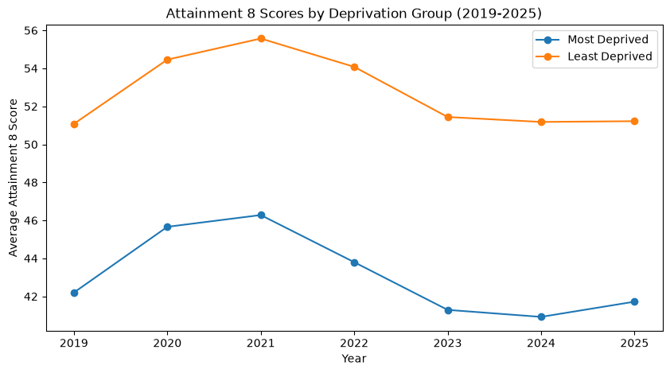

# Deprivation + School Performance (England 2019-25)

**Group 6 Members:** Aisling, Kara, Olesya, Olivia, Raquel, and Sotiria  

---

### Introduction
This project aims to examine the relationship between regional deprivation and Key Stage 4 (KS4) performance in England between 2019 and 2025.  
**Project research questions:**  
**Q1:** How does overall school performance vary between the most and least deprived Local Authorities, and has this attainment gap widened or narrowed between 2019 and 2025?  
**Q2:** Among the different sub-domains of deprivation, which specific factor (if any) has the strongest negative correlation with a region's educational outcomes?  
**Q3:** Are there certain core EBacc subjects (e.g., Maths, Science, Humanities, Languages) that are more resilient to the effects of deprivation compared to others?  
**Q4:** How does the performance gap between boys and girls change across different deprivation levels?  
**Q5:** How does the performance of pupils with English as an Additional Language (EAL) compare to first-language English speakers across different deprivation levels?  
**Q6:** Which Local Authorities consistently outperform or underperform their predicted Attainment 8 score, and is there a geographic pattern among these outliers?  

**Project SMART-D objectives:**  
**-** Analyse the relationship between deprivation and educational attainment over time   
**-** Identify which deprivation factors, subjects, and demographics most strongly influence attainment   
**-** Identify Local Authorities that over/underperform and examine spatial patterns in attainment   

**Roadmap of report structure**   
**Background** - provide context and explain the importance of our research.   
**Methodology** - provide details of the data sources and how analysis was approached.  
**Implementation** - discuss challenges, roles of members and agile practices.  
**Results** - highlight results of each research question.  
**Conclusion** - discuss recommendations, limitations, and future work suggestions.  

---

### Background
**Context and importance of this research**  
Educational outcomes in England vary by socio-economic context. This study uses quantitative analysis to examine how deprivation relates to attainment across regions and over time. Understanding the relationship between deprivation and educational attainment is key to identifying educational inequality and informing targeted policy.  
**Target audience:** DfE policymakers, educational charities/NGOs, and school leaders.

### Methodology and Design
**Data sourcing and preprocessing**  
**Sources:** DfE KS4 Data (2018/19–2024/25), IMD 2019 (LSOA level), and ONS boundary lookups.  
**Aggregation:** LSOA-level IMD scores were aggregated to Upper-tier Local Authority (UTLA) level using population-weighted averages.  
**Data Cleansing:** Reconciled boundary shifts, converted DfE suppression flags ('c', 'z') to `NaN`, and excluded COVID-affected years (2019/20 and 2020/21) due to teacher-assessment grade inflation.

**Analysis methodology**  
Each research question was answered using a specific analytical approach.  
**Q1** - Ranked Local Authorities (LAs) using 2019 Index of Multiple Deprivation (IMD) scores. Selected the 10 most and least deprived LAs. Average Attainment 8 scores were calculated annually between 2019 and 2025 for each group. The difference between the two groups was used to measure the attainment gap over time.  
**Q2** - Calculated correlations for 7 measures of deprivation against average attainment 8 scores. Correlations were examined overall and split by academic year. Correlation analysis measured both the direction (positive/negative) and strength of relationships between each deprivation factor and attainment 8 averages.  
**Q3** - Subject-specific APS scores were analysed for five subjects. Deprivation measures used: average IMD score and % of highly deprived neighbourhoods within each Local Authority. Correlation analysis assessed relationships between deprivation and attainment, followed by decile grouping and participation analysis.  
**Q4** - Utilised correlation analysis, ANOVA, and quintile-based group comparisons to assess how deprivation relates to the gender attainment gap.  
**Q5** - Utilised linear regression to assess the relationship between deprivation and attainment. Group comparison made between EAL and first-language English pupils.   
**Q6** - Per-year linear regressions of Attainment 8 against IMD were used to calculate LA residuals. LAs with mean residuals >1 SD from the mean classified as consistent over or underperformers. Geographic and sub-domain analyses assessed if performance was associated with London status or deprivation dimensions.   

---

### Implementation
**Development approach and roles of each team member**  
The project followed an iterative workflow with regular individual contributions into a shared repository. 
After initial shared data cleaning, each member led one research question, enabling parallel analysis.  
**Question 1:** Sotiria  
**Question 2:** Olivia  
**Question 3:** Olesya  
**Question 4:** Raquel  
**Question 5:** Kara  
**Question 6:** Aisling   

The following are used throughout the project: Python (Pandas, NumPy, SciPy) and Matplotlib/Seaborn.
Version control was managed using Git/GitHub to assist with collaboration and reproducibility.

**Key achievement and challenges faced**  
Each member faced different challenges throughout the project. Our varying levels of confidence with GitHub and different analytical approaches meant that ongoing peer support was needed. Every challenge contributed to skill development and led to each member becoming more confident overall. Our key achievement was successfully delivering meaningful research despite initial differences in experience and confidence levels.

### Results
**Q1 - Performance by deprivation level over time**  
Educational attainment was consistently higher in the least deprived LAs than in the most deprived. Least deprived LAs had Attainment 8 scores ranging from 51.08-55.57, while most deprived LAs achieved scores ranging from 40.92-46.28 (Fig 1.1). The attainment gap increased from 8.88 points in 2019 to a 10.28 points peak in 2022 before narrowing slightly to 9.50 points in 2025.   
Both groups had fluctuations over time but performance gap remained substantial across all years, suggests persistent relationship between deprivation and educational outcomes. Higher deprivation remains associated with lower educational attainment.

  

<em>Figure 1.1: Average Attainment 8 scores for the 10 most and least deprived Local Authorities 2019-2025.</em>

**Q2 - Specific deprivation factors**  
Each deprivation factor had consisent correlations with attainment 8 across years analysed. Health deprivation had the strongest negative correlation. Employment and income-related deprivation showed moderate negative correlations. Crime deprivation exhibited a weaker negative correlation and living environment deprivation had almost no correlation. In contrast, barriers to housing had a positive correlation (Table 2.1). 

**Table 2.1.** Overall correlation between deprivation factors and attainment 8 averages.

| Deprivation Factor | Correlation |
|-------------------|------------:|
| Health            | -0.622 |
| Employment        | -0.583 |
| IDACI             | -0.494 |
| Income            | -0.489 |
| Crime             | -0.274 |
| Living Environment| -0.000 |
| Barriers          | 0.350 |

**Q3 - Subject-specific resilience**  
All five subjects showed negative relationship between deprivation and attainment. Maths, Science and Humanities show the strongest correlations with deprivation, while Languages shows the weakest relationship. Similar patterns are observed using both deprivation measures, suggesting findings are robust (Table 3.1).

**Table 3.1:** Correlation between deprivation and subject attainment

Subject | r(IMD) | r(% High Deprivation)
--------|-------:|--------:
Eng | -0.52 | -0.53
Math | -0.61 | -0.61
Sci | -0.60 | -0.60
Hum | -0.60 | -0.59
Lang | -0.31 | -0.36

Local Authorities were grouped into deprivation deciles to compare attainment across the deprivation spectrum and calculate attainment gaps between the least and most deprived authorities. Average attainment declines steadily as deprivation increases across all subjects. Humanities show the largest attainment gap (1.05 APS points), followed by Science (0.91) and Maths (0.89). English (0.73) and Languages (0.75) show the smallest gaps, suggesting greater resilience to deprivation (Table 3.2). 

**Table 3.2:** Average APS scores across deprivation deciles
Deciles | English	| Maths |	Science	| Humanities|	Languages
--|-------|----------|--------|-----------|---------
Least deprived	| 5.33	| 5.05	| 5	| 4.34	| 2.62
Most deprived	| 4.6	| 4.15 |	4.09	| 3.29	| 1.87
Gap	| 0.73 |	0.9	| 0.91 |	1.05 |	0.75

Finally, subject participation rates were analysed to investigate whether deprivation influences subject entry patterns. Entry rates for English, Maths and Science remain consistently high across deprivation groups, while Humanities decline moderately. Languages show the largest reduction, falling from 48.6% in the least deprived authorities to 38.7% in the most deprived authorities (Table 3.3).

**Table 3.3:** Subject participation rates across deprivation deciles  

Deciles | Eng % | Maths % | Sci % | Hum % | Lang %  
--------|------:|--------:|------:|------:|------:  
Least deprived | 95.55 | 97.28 | 95.55 | 82.96 | 48.61  
Most deprived  | 93.51 | 95.85 | 93.48 | 77.85 | 38.65  
Gap            | 2.04  | 1.43  | 2.07  | 5.11  | 9.96  S

**Q4 - The gender gap and deprivation**  
***Correlation & ANOVA:*** Deprivation weakly but significantly correlates with a wider gender gap, explaining around 1.8% of the variation in that gap.  
***Impact:*** The attainment gap widens with deprivation, particularly between quintile 4 and 5. Compared with the least deprived group, Attainment 8 scores are 14.41% lower for boys and 12.21% lower for girls in the most deprived group, with boys experiencing a slightly greater decline overall (Fig 4.1).

  

  

  <em>Figure 4.1: IMD Score vs. gender gap (left) and % change in Attainment 8 from Q1 by quintile (right).</em>

**Q5 - Language background and deprivation**  
***Correlation:*** Linear regression analysis found a negative relationship between deprivation (IMD and IDACI scores) and attainment (Fig 5.2). Higher deprivation is associated with lower educational achievement.  
***Findings:*** Although attainment declined with increasing deprivation for all pupils, EAL pupils consistently achieved similar or slightly higher outcomes than first-language English speakers (Fig 5.1), suggesting that socio-economic deprivation has a greater impact on attainment than language background.

   
  

  

  <em>Figure 5.1: Mean attainment across EAL and English speakers</em>

   
  

  <em>Figure 5.2: Relationship between Deprivation and Attainment using IMD score </em>

**Q6 - Geographic patterns of over and underperformance**  
19 LAs were classified as overperformers and 20 as underperformers. Of the overperforming LAs, 14 are London boroughs (73.7%). No underperformers are London boroughs. This is consistent with the "London Effect", a pattern of sustained educational outperformance relative to deprivation documented in DfE research (see, Ross et al., 2020). Underperforming LAs show a more complex picture. They include both rural and costal LAs, likely with different drivers of inequality and barriers.

Figure 6.1 shows London boroughs achieving higher Attainment 8 scores than non-London LAs. London's steeper regression slope (-0.40 vs -0.26) suggests this advantage narrows as deprivation increases. London's IMD scores only extend to ~33, so whether the advantage is seen at higher deprivation levels cannot be confirmed.

  

  <em>Figure 6.1: Scatter plot of IMD Score vs. Attainment 8 Average for London (red) and non-London (blue) LAs.</em>

Figure 6.2 confirms that over- and underperformance is consistent. London LAs are persistently positive and many non-London LAs are persistently negative. Several London LAs show widening positive residuals between 2018/19 and 2024/25 (Richmond upon Thames +3.15, Southwark +3.02, Kingston upon Thames +2.92), while several rural/coastal underperformers show worsening residuals over the same period (Shropshire -3.17, Dorset -2.64, East Sussex -1.70). 

  

  <em>Figure 6.2: Spaghetti plot showing residual trends over time with London LAs in red and non-London LAs in blue.</em>

### Conclusion
**Summary of insights**   
This project shows a consistent relationship between deprivation and educational attainment across England. More deprived Local Authorities achieve lower Attainment 8 scores, with the gap increasing until 2022 before narrowing slightly but remaining substantial in 2025.   
Health, income, and employment deprivation show the strongest negative associations with attainment. All EBacc subjects are affected, particularly Maths, Science, and Humanities. Language participation is lower in more deprived areas which indicates that pupils in more deprived areas are substantially less likely to study a language qualification.   
Deprivation is weakly associated with a gender gap, with boys being slightly more affected than girls. Whilst EAL pupils achieve similar-slightly higher outcomes than first-language English speakers.   
Finally, London boroughs consistently outperform other areas and this “London effect” persists even after accounting for deprivation. No deprivation sub-domain shows a clear relationship with performance group once London membership is controlled for, suggesting the drivers of the London Effect are structural rather than reducible to any single IMD dimension.

**Limitations of analysis**   
**-** LA-level aggregation hides local pockets of deprivation (ecological fallacy); boundary changes limit longitudinal reliability.  
**-** Some KS4 data points are suppressed or incomplete, requiring cleaning decisions that may introduce minor bias.  
**-** Observation and use of correlation/regression methods means results show association rather than causation.  

**Recommendations for stakeholders**   
**-** Target Pupil Premium funding at underperforming rural and coastal Local Authorities with persistent attainment gaps.
**-** Investigate drivers of the London effect, in particular what structural, cultural, or policy factors sustain and accelerate London's advantage.
**-** Use subject-level findings to inform curriculum support strategies in high-deprivation areas where attainment gaps are largest.

**Suggestions for future work**   
Future work should include: Transition to school-level analysis; integrate student attendance/mental health datasets; update models when new IMD data is released. Future studies into the efficacy of non-academic interventions to increase attainment would therefore merit investigation into the structural, cultural and other areas of difference between London and the rest of England.

### References
- Ross, A., Lessof, C., Brind, R., Khandker, R. and Aitken, D. (2020) Examining the London advantage in attainment: evidence from LSYPE. London: Department for Education. Available at: https://assets.publishing.service.gov.uk/media/5fb7cc538fa8f559dbb1ad4b/London_effect_report_-_final_20112020.pdf (Accessed: 19 June 2026).